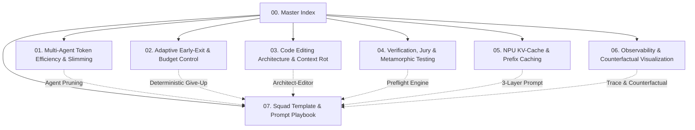

# Efficient Agent Squad Engineering & Research Index
> **JUNCTIONX Korea 2026 (HACK OUR ORIGIN)**  
> **Lablup + FuriosaAI Track:** *Build the Ultimate Agent Squad*  
> **Target Goal:** Accuracy (40%) + Visualization (30%) + Token Efficiency (30%) Triple Pareto Optimization

---

## 📌 1. 해커톤 & 트랙 핵심 요약 (Executive Summary)

본 문서는 **JUNCTIONX Korea 2026**에서 진행되는 **Lablup + FuriosaAI 트랙 ("Build the Ultimate Agent Squad")**을 제패하기 위해, 에이전트 스쿼드 아키텍처, 토큰 효율성, 검증 메커니즘, NPU/KV-Cache 최적화, 옵저버빌리티 및 인터랙티브 시각화에 대해 웹 심층 리서치와 학술/엔지니어링 근거를 집대성한 종합 연구 자료집입니다.

### 트랙 핵심 규격 & 제약 사항 매트릭스

| 핵심 축 | 세부 규칙 및 실측 데이터 | 스쿼드 엔지니어링 전략 |
|---|---|---|
| **배점 구조 (100점)** | 벤치마크 40점 + 인터랙티브 시각화 30점 + 토큰 효율성 30점 | 동점 판정 1순위가 **총 토큰 소모량**, 2순위가 Wall-clock 시간. 토큰 효율은 30점 독립 축이자 40점 축의 결정타 |
| **벤치마크 가중치** | `Score = 0.5×coding + 0.25×generic + 0.25×math` | 가중치는 문항 수 비율이 아닌 **정확도 계수**. Coding 1문항의 가치가 Generic의 ~10배. 예산과 복잡도를 Coding에 집중 |
| **제출물 제약** | **단 1개의 Squad Template JSON** + 트랙별 One-shot 프롬프트 3개 | 단일 템플릿 내에서 Router가 `payload.kind`에 따라 Coding / Math / Generic으로 경로 및 예산을 동적 분기 |
| **채점 방식** | **100% 결정론적 프로그램 Grader** (Docker pytest, stdin/stdout, 정수/수식 동치, 보기 일치) | LLM-as-a-judge 전무. 미사여구는 점수 0점. 오직 출력 형식(SEARCH/REPLACE, `\boxed{}`, ANSWER) 준수가 생명 |
| **런타임 도구 제약** | 평가 실행 중 스쿼드의 호스트 도구(`search_files`, `execute_python` 등) **완전 차단** | 코드 검색 에이전트는 무의미. Judge가 주입한 60KB 발췌 컨텍스트에서 **무손실 위치 인덱싱 & 패치 생성**에 집중 |
| **응답 채점 규칙** | *"If more than one appears, the last one is used. Anything before it is ignored, not penalised."* | **응답 본문 앞부분은 감점 없는 계측/로그/초안 공간.** 장부(Ledger) 기록을 응답 본문에 작성 시 계측 비용 0 |
| **평가 모델 구성** | 3종 중 2종이 Reasoning 모델 (출력의 97%를 사고 토큰에 소모) + 1종 Instruct (`Qwen3-30B-FP8`) | Reasoning 모델 무차별 사용 시 토큰 캡 폭발. Instruct 기본 + 필요 시 국소적 사고 토큰 제어 |

---

## 🗂️ 2. 심층 리서치 문서 인덱스 (Research Architecture Map)

본 자료집은 최신 AI 학회(ACL, ICML, ICLR, IEEE TVCG) 논문 및 최첨단 엔지니어링 실측 데이터(FuriosaAI NPU, Backend.AI, Aider, OpenTelemetry, Chroma)를 기반으로 작성된 7개의 심층 문서로 구성되어 있습니다.

### 문서별 세부 요약

1. **[01. Multi-Agent Token Efficiency & Slimming](./01-multi-agent-token-efficiency-and-slimming.md)**
   - 멀티에이전트 통신 오버헤드 실측 및 실패 원인 분석 (Anthropic 15x 오버헤드, MAST 1600+ 트레이스 실패 분류학).
   - AgentSlimming (ACL 2026, 78.9% 토큰 절감), GPTSwarm (ICML 2024), Cost-of-pass (Efficient Agents 2025).
   - 불필요한 에이전트 대화 제거 및 5-Agent 최소 최적 스쿼드 구조 도출.

2. **[02. Adaptive Early-Exit & Budget Control](./02-adaptive-early-exit-and-budget-control.md)**
   - 프롬프트 기반 예산 지시의 실패(s1 Budget Forcing 한계)와 결정론적 예산 집행 원리.
   - ReASC (신뢰도 기반 베이지안 조기 정지), REFRAIN (SW-UCB 밴딧 기반 오버씽킹 방지), SeerSC (System 1 난이도 예측).
   - 3계층 하드 캡 (max_tokens / AI:GO Budget Turns / 러너 잔액 산수) 기반 조기 포기(Give-Up) 메커니즘.

3. **[03. Code Editing Architecture & Context Rot](./03-code-editing-architectures-and-context-rot.md)**
   - 가중치 0.50 Coding 트랙 정조준: Context Rot 현상(Chroma 2025 리서치, 18개 모델 실측)과 60KB 컨텍스트 한계.
   - SEARCH/REPLACE 블록 포맷(Diff-XYZ 벤치마크) vs Unified Diff. Aider Architect-Editor 2-Tier 패턴 분석.
   - Architect(무손실 앵커 추출) → Editor(외과의사식 SEARCH/REPLACE 패치 작성) 파이프라인.

4. **[04. Verification, Jury & Metamorphic Testing](./04-verification-jury-and-metamorphic-testing.md)**
   - LLM 검증자의 비효율성 실측 ("When To Solve, When To Verify" arXiv:2504.01005).
   - Deterministic Preflight(정규식/문자열 대조), Blind Jury(독립 투표), Metamorphic Guard(불변성 검사).
   - LLM 호출 0회의 Preflight 검증기 구축으로 `extraction_failed` 및 형식 불일치 0건 달성.

5. **[05. NPU KV-Cache & Prefix Caching](./05-npu-kv-cache-and-prefix-caching.md)**
   - FuriosaAI RNGD NPU & Backend.AI 인프라 특화 Automatic Prefix Caching (APC) 최적화.
   - Radix Tree 토큰 매칭, 인-문항(In-item) 멀티에이전트 60KB 컨텍스트 공유 메커니즘.
   - 프롬프트 3층 구조(대회 공통 → 문항 컨텍스트 → [캐시 경계] → 에이전트 지시)로 캐시 히트 70%+ 달성.

6. **[06. Agent Observability & Counterfactual Visualization](./06-agent-observability-and-counterfactual-visualization.md)**
   - 시각화 30점 공략. OpenTelemetry GenAI Semantic Conventions v1.41 표준 준수.
   - Zero-LLM Counterfactual Replay(무료 반사실 재생기, 슬라이더 기반 Ablation 시뮬레이션).
   - 주최 열거형(`Outcome`, `FailureKind`, `FailureOwner`) 기반 Root-Cause Failure Attribution Sankey 다이어그램.

7. **[07. Squad Template & Prompt Engineering Playbook](./07-squad-template-and-prompt-engineering-playbook.md)**
   - 단 1개의 AI:GO Squad Template JSON 및 3종 One-shot 프롬프트 실전 설계.
   - `{{TASK}}` 치환 규칙, REQUIRED OUTPUT 후처리 정렬, 웨이브 역순 답안 추출 규칙 완벽 준수.
   - LEDGER Squad 템플릿 스키마 및 트랙별 프롬프트 완제품 코드.

---

## 🏆 3. 핵심 아키텍처 비교 매트릭스

| 아키텍처 패턴 | 정확도 (40) 기여 | 토큰 효율 (30) 기여 | 시각화 (30) 기여 | 본 트랙 채택 전략 |
|---|---|---|---|---|
| **Naive Multi-Agent (전원 자유토론)** | ⚠️ 낮음 (오류 전파, Context Rot) | ❌ 최악 (토큰 15x 폭발) | ⚠️ 복잡한 스파게티 그래프 | **배제** |
| **Heavy Generative Verifier (GenRM)** | ⚠️ 보통 (검증자 착각 존재) | ❌ 불량 (검증 비용 과다) | 보통 | **배제 (Preflight로 대체)** |
| **Aider Architect-Editor Pattern** | 🏆 극상 (SEARCH/REPLACE 특화) | 🏆 우수 (앵커로 컨텍스트 격리) | 🏆 명확한 2단계 파이프라인 | **Coding 트랙 메인 채택** |
| **Prefix-Cache 3-Layer Prompting** | 보통 | 🏆 극상 (입력 토큰 최대 75% 절감) | 🏆 KV Cache Hit 계측 시각화 | **전 트랙 공통 인프라 채택** |
| **Deterministic Preflight Guard** | 🏆 극상 (`extraction_failed` 방지) | 🏆 극상 (LLM 호출 0회) | 🏆 형식 검증 실패 로그 노출 | **전 트랙 필수 채택** |
| **Zero-LLM Counterfactual Replay** | - (오프라인) | 🏆 극상 (추가 LLM 호출 0회) | 🏆 Insightfulness 1등 공략 | **시각화 메인 엔진 채택** |\n