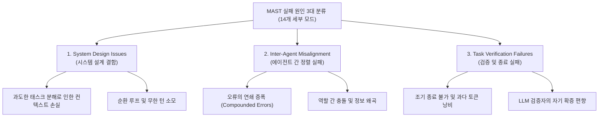
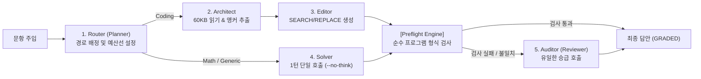

# 01. Multi-Agent Token Efficiency & Slimming (멀티에이전트 토큰 효율성 및 경량화 연구)

> **핵심 테제:** 멀티에이전트 시스템은 단일 에이전트 대비 최대 15배의 토큰을 소모하지만 성능 향상은 1%p 미만이거나 오히려 실패율이 증가할 수 있다. 토큰 낭비의 근본 원인을 규명하고, 최신 프루닝(Pruning) 및 그래프 최적화(Graph Optimization) 이론을 통해 최소-최적의 스쿼드를 구축한다.

---

## 1. 멀티에이전트의 현실적 한계와 비용 패러독스

### 1.1 Anthropic 실측 보고서: 코딩 과제의 멀티에이전트 비효율성
- **토큰 오버헤드:** Anthropic의 다중 에이전트 벤치마크 분석에 따르면, 다중 에이전트 간 자유 자연어 토론(Free-form multi-agent dialogue)은 단일 턴 질의 대비 **약 15배의 토큰**을 소모한다.
- **코딩 과제 부적합성:** 자율적으로 역할을 나누어 대화하는 멀티에이전트는 코드베이스 컨텍스트의 중복 전송, 이전 에이전트의 환각 누적, 모호한 책임 분담으로 인해 SWE-bench 등 실제 코딩 과제에서 단일 고성능 모델(Single prompt with tools)보다 낮은 정확도를 기록하는 경우가 빈번하다.

### 1.2 MAST 벤치마크: Multi-Agent System Failure Taxonomy (arXiv:2503.13657)
2025년 발표된 MAST 연구는 7개 주요 멀티에이전트 프레임워크(AutoGen, CrewAI, MetaGPT, LangGraph 등)의 1,600개 이상 실행 트레이스를 분석하여 멀티에이전트의 실패율이 **41.0% ~ 86.7%**에 달함을 실측했다.



- **조정 비용(Coordination Tax):** 에이전트 수가 증가할수록 통신 채널은 $O(N^2)$으로 증가하며, 유의미한 정보 획득량 대비 통신 오버헤드가 기하급수적으로 폭증한다.
- **결론:** 에이전트의 수를 늘리는 것은 점수가 아니며, 명확한 책임과 결정론적 입출력 계약(Typed Packet)을 갖춘 최소 구성만이 유효하다.

---

## 2. 최신 에이전트 경량화 및 최적화 프레임워크

### 2.1 AgentSlimming: Graph-Structured Multi-Agent Pruning (ACL 2026)
AgentSlimming(ACL 2026)은 딥러닝의 가중치 가지치기(Pruning) 및 양자화(Quantization) 개념을 멀티에이전트 워크플로우 그래프에 적용한 선구적 프레임워크이다.

```
AgentSlimming 핵심 파이프라인:
[초기 에이전트 그래프] ──> [Importance Score 평가] ──> [Node/Edge Pruning] ──> [Model Downgrade] ──> [최적 슬림 스쿼드]
```

- **중요도 점수(Importance Score):** 각 에이전트 노드 $v_i$와 통신 엣지 $e_{ij}$가 최종 작업 정확도에 기여하는 한계 기여도(Marginal Contribution)를 측정.
- **가지치기(Pruning):** 한계 기여도가 역치 이하인 에이전트 노드 및 불필요한 토론 루프 엣지를 영구 제거.
- **모델 다운그레이드(Model Quantization):** 복잡한 추론이 필요 없는 중간 파싱, 포맷팅, 라우팅 노드를 초경량 Instruct 모델이나 결정론적 코드로 대체.
- **실측 성능:** 평균 토큰 비용 **최대 78.9% 절감**, 작업 성공률은 기준선 대비 99% 이상 유지.

### 2.2 GPTSwarm: Optimizable Computational Graphs (ICML 2024)
GPTSwarm(ICML 2024)은 LLM 에이전트 군집을 최적화 가능한 연산 그래프(Computational Graph)로 공식화했다.
- **노드 수준 최적화:** 개별 에이전트의 시스템 프롬프트 및 Few-shot 예시를 자동 미세조정.
- **토폴로지 최적화:** 정적인 계층 구조 대신 데이터 흐름에 따른 최적의 통신 그래프를 학습.
- **시사점:** 사람이 직관으로 설계한 복잡한 에이전트 구조보다, 실측 점수와 토큰을 기준으로 진화시킨 단일 최적 토폴로지가 훨씬 우수하다.

---

## 3. 비용 정규화 리더보드 실측 데이터 및 시사점

주요 글로벌 벤치마크들은 더 이상 단순 정확도(Raw Accuracy)만을 보지 않고, **비용 정규화 지표(Cost-Normalized Metric)**를 도입하고 있다.

| 벤치마크 / 연구 | 모델 및 전략 비교 | 비용 차이 | 성능 차이 | 핵심 시사점 |
|---|---|---|---|---|
| **ARC Prize 2025/2026** | Gemini 3.7 Flash vs Gemini 3 Deep Think | **$0.249 vs $13.62 (54.7배)** | **84.6% vs 84.6% (0%p)** | 사고 강도를 무조건 올린다고 정답률이 오르지 않음 |
| **SWE-bench bash-only** | MiniMax M2.5 vs Claude 4.5 Opus | **$0.07 vs $0.75 (10.7배)** | 75.8% vs 76.8% (+1.0%p) | 1%p 향상을 위해 10배 이상의 비용이 소모됨 |
| **HAL (Princeton, arXiv:2510.11977)** | 36개 Reasoning 스케일링 실험 | 고비용 모델 100배 지출 | **36개 중 21개는 정확도 0%p 상승** | 파레토 최적 경계에 도달하는 모델은 극소수 |
| **Efficient Agents (arXiv:2508.02694)** | Cost-of-pass 최적화 에이전트 | **비용 42.7% 절감** | GAIA 벤치마크 96.7% 유지 | 무조건적인 에이전트 추가는 낭비 |

---

## 4. 본 트랙(Lablup + FuriosaAI) 적용 전략

### 4.1 5인 최소 최적 스쿼드 구조 (Minimal Viable Squad)
과도한 다자간 토론을 제거하고, 단방향 Typed Handoff를 수행하는 5개 역할로 압축한다:



### 4.2 PacketBus: 고정 스키마 기반 Typed Packet 통신
자연어 대화 대신 고정된 JSON 스키마를 통해 정보를 전달하여 컨텍스트 낭비와 의미 변질을 차단한다.

```json
{
  "packet_id": "pkt_001",
  "source_agent": "Architect",
  "target_agent": "Editor",
  "task_kind": "coding",
  "file_path": "astropy/io/ascii/rst.py",
  "anchor_lines": [27, 45],
  "reasoning_summary": "Fix delimiter mismatch in RST parser table reader",
  "verbatim_context": "def write(self, table):\n    lines = []..."
}
```

- **토큰 절감 효과:** 이전 대화 기록 전체를 포워딩하지 않고, 필요한 발췌 hunk와 메타데이터만 전달하여 60KB 컨텍스트 중복 로드를 1회로 제한.
