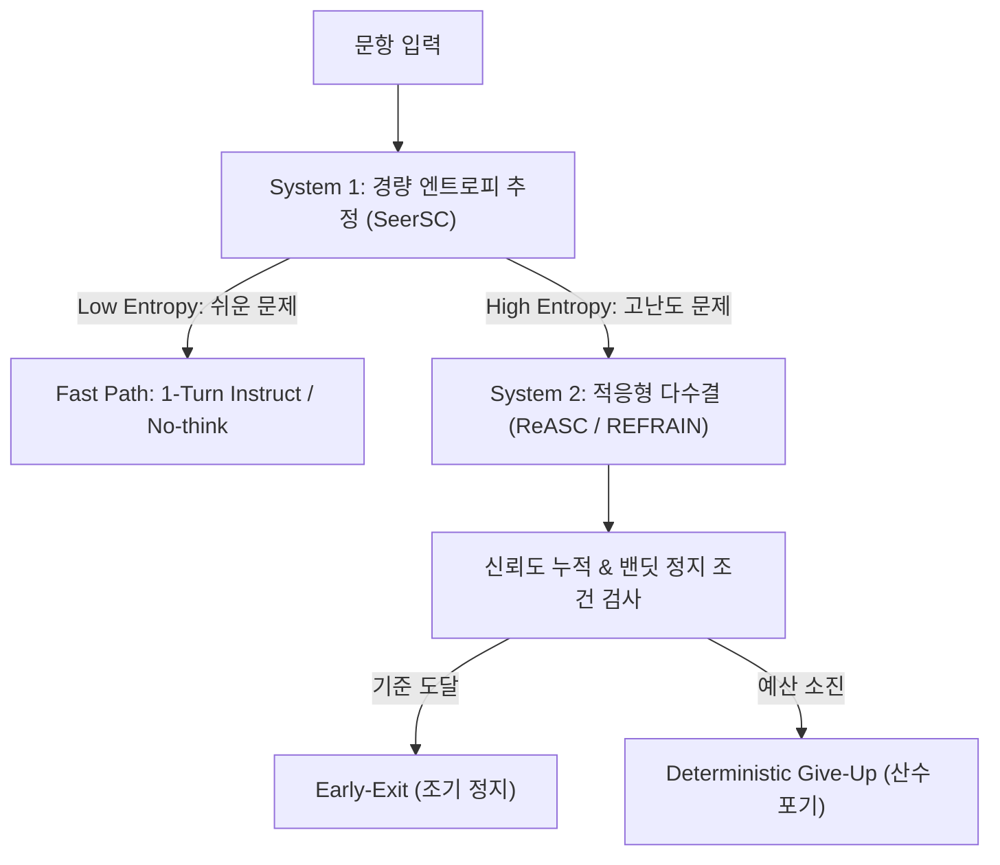

# 02. Adaptive Early-Exit & Budget Control (적응형 조기 종료 및 예산 통제 연구)

> **핵심 테제:** LLM에게 자연어 프롬프트로 "토큰을 아끼라"고 지시하는 것은 실패한다. 모델의 고유한 사고 토큰 팽창 특성을 이해하고, 최신 베이지안/밴딧 기반 조기 정지(Early-Stopping) 이론과 결정론적 3계층 하드 캡을 결합하여 토큰 파레토 최적화를 달성한다.

---

## 1. 프롬프트 기반 예산 통제의 실패 실측 (s1 연구)

### 1.1 s1: Simple test-time scaling (arXiv:2501.19393, EMNLP 2025)
s1 연구팀은 추론 시점(Test-time)의 연산량을 조절하기 위해 프롬프트 지시와 인퍼런스 조작을 광범위하게 실험했다.

```
[연구의 핵심 발견]
1. 프롬프트 무용성: "500 토큰 이내로 생각하고 답하라"는 시스템 프롬프트는 완벽히 무시된다.
   LLM은 자신이 현재 몇 개의 토큰을 생성했는지 카운팅할 수 있는 메타인지 능력이 없다.
2. 스텝 수 지시의 역효과: "3단계 이내로 추론하라"고 지시하면, 모델은 각 단계의 텍스트 길이를
   기하급수적으로 늘려 총 토큰 소비량은 동일하거나 오히려 증가한다.
3. 유일한 해결책: 인퍼런스 엔진 레벨의 강제 주입(Budget Forcing) 및 토큰 하드 캡(Hard Cap).
```

### 1.2 본 트랙 평가 모델의 사고 토큰 함정
- 본 트랙 평가 모델 3종 중 **2종이 Reasoning 모델**이며, 측정 결과 출력 예산의 **97%를 `<think>` 사고 토큰**에 소모함이 확인되었다.
- 문항당 토큰 상한(`per_item_token_cap`) 및 런당 상한(`per_run_token_cap`)이 존재하는 환경에서, 무제한 reasoning은 문항 몇 개만에 전체 런을 조기 파산(`capped_tokens`)으로 이끈다.

---

## 2. 최신 적응형 조기 종료(Adaptive Early-Exit) 이론



### 2.1 ReASC: Reliability-Aware Adaptive Self-Consistency (Findings of ACL 2026)
- **원리:** 단순히 고정된 횟수(예: $N=10$)만큼 샘플링하는 대신, 각 샘플의 모델 신뢰도(Confidence)를 추출하여 베타 사후 분포(Beta Posterior Analysis)로 누적 증거를 갱신.
- **조기 정지 메커니즘:** 두 후보 답안 사이의 승률 차이가 신뢰구간(Confidence Interval) $1 - lpha$를 초과하는 즉시 샘플링을 중단. 쉬운 문제는 $N=1\sim 2$에서 즉시 종료.
- **효과:** 일괄 다수결 대비 **계산 비용 64% 절감**, 정확도 보존.

### 2.2 REFRAIN: Reflective-Redundancy for Adaptive Inference (ACL 2026 Long)
- **오버씽킹(Overthinking) 억제:** 추론 모델이 이미 정답을 도출한 후에도 불필요하게 검증 루프를 돌며 토큰을 낭비하고 오답으로 전락하는 현상을 방지.
- **2단계 정지 판별기(Two-stage Stop Discriminator):** 현재 추론 경로의 중복도를 감지하고, 슬라이딩 윈도우 UCB(Upper Confidence Bound) 다중 암드 밴딧을 통해 문제 난이도별 최적 종료 임계치를 동적 적응.

### 2.3 SeerSC: Seer Self-Consistency (Findings of ACL 2026)
- **System 1 + System 2 결합:** 초경량 모델 또는 지시형 모드로 첫 턴의 답변 엔트로피(Answer Entropy)를 고속 측정.
- **사전 예산 할당:** 엔트로피가 낮으면 추가 샘플링 예산을 0으로 동결하고 즉시 반환, 엔트로피가 높을 때만 비례하여 추가 토큰 예산 승인.

---

## 3. 본 트랙의 결정론적 3계층 하드 캡 & 조기 포기(Give-Up) 아키텍처

본 트랙에서는 LLM의 판단에 기대지 않고, 순수 프로그램 산수(Arithmetic)에 의해 집행되는 3계층 예산 통제 시스템을 가동한다.

```
┌─────────────────────────────────────────────────────────────────────────┐
│                      3계층 결정론적 예산 통제 아키텍처                    │
├─────────┬──────────────────────────────────┬────────────────────────────┤
│ 계층    │ 메커니즘                         │ LLM 관여도                 │
├─────────┼──────────────────────────────────┼────────────────────────────┤
│ Layer 1 │ API 파라미터 `max_tokens` 하드 캡 │ 0% (인퍼런스 엔진 레벨)    │
│         │ - Coding: 4,096 토큰             │                            │
│         │ - Math: 1,024 토큰               │                            │
│         │ - Generic: 256 토큰              │                            │
├─────────┼──────────────────────────────────┼────────────────────────────┤
│ Layer 2 │ AI:GO Budget Config              │ 0% (런타임 오케스트레이터) │
│         │ - Max agent turns:               │                            │
│         │   Coding=6, Math=3, Generic=1    │                            │
│         │ - Max plan iterations = 1        │                            │
├─────────┼──────────────────────────────────┼────────────────────────────┤
│ Layer 3 │ Runner Level Arithmetic Give-Up  │ 0% (실행 러너 산수)        │
│         │ - 잔여 예산 < 다음 시도 견적 시  │                            │
│         │   추가 에이전트 호출 즉시 중단   │                            │
└─────────┴──────────────────────────────────┴────────────────────────────┘
```

### 3.1 트랙별 차등 예산 배분 공식
$$	ext{Budget}(item) = egin{cases} 
B_{	ext{high}} = 18,000 	ext{ tokens} & (	ext{Coding, Weight}=0.50) \
B_{	ext{mid}} = 2,500 	ext{ tokens} & (	ext{Math, Weight}=0.25, 	ext{Repeats}=2) \
B_{	ext{low}} = 600 	ext{ tokens} & (	ext{Generic, Weight}=0.25)
\end{cases}$$

- Generic 문항(총 448~698개)에 토큰을 쏟는 것은 기대 점수 대비 최악의 투자이다. Generic은 1턴 직행(`--no-think`)으로 최소 토큰만 소모하고, 절약한 예산을 가중치 0.50의 Coding 트랙에 집중 투입한다.
