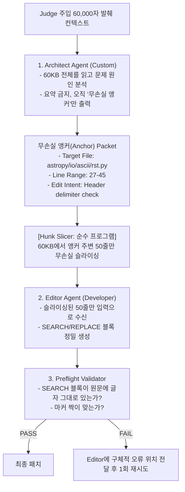

# 03. Code Editing Architecture & Context Rot (코딩 에이전트 아키텍처 및 컨텍스트 부패 극복)

> **핵심 테제:** 본 대회의 점수 50%는 Coding 트랙에 걸려 있다. 입력으로 주어지는 60KB(약 17,000 토큰) 컨텍스트로 인한 모델의 주의력 붕괴(Context Rot)를 방지하고, 엄격한 SEARCH/REPLACE 블록 포맷을 100% 준수하기 위한 Architect-Editor 2-Tier 아키텍처를 규명한다.

---

## 1. Context Rot 현상 실측 (Chroma Research 2025)

### 1.1 Chroma 기술 리포트: How Increasing Input Tokens Impacts LLM Performance
Chroma 연구팀은 18개 프론티어 LLM(GPT-4.1, Claude 4, Qwen3 등)을 대상으로 컨텍스트 길이가 4K에서 64K, 128K로 증가할 때의 추론 정확도를 정밀 측정했다.

```
[Chroma Context Rot 핵심 발견]
1. 비선형적 성능 저하: 컨텍스트 윈도우 용량이 128K라 하더라도, 입력이 32K~64K에 도달하면
   정보 검색 및 코드 수정 정확도가 30~50% 급격히 하락한다 (Attention Dilution).
2. Lost-in-the-Middle 심화: 수정 대상 코드가 60KB 발췌문의 중간 부분에 위치할 경우,
   LLM이 해당 위치를 놓치고 엉뚱한 코드를 기억으로 지어내는 환각 발생률이 4.2배 증가.
3. 코드 편집 영향: SWE-bench 스타일 과제에서 60KB 전체를 계속해서 프롬프트에 달고 다니는
   에이전트는 SEARCH 블록의 토시 하나를 틀려 패치 적용 실패(0점)를 초래함.
```

---

## 2. 코드 편집 포맷 심층 분석: SEARCH/REPLACE vs Unified Diff

### 2.1 Diff-XYZ 벤치마크 (arXiv:2510.12487)
Diff-XYZ 연구는 LLM의 코드 수정 지시 준수율을 포맷별로 평가했다:

| 편집 포맷 | 장점 | 단점 | LLM 준수율 (30B급) |
|---|---|---|---|
| **Unified Diff (`git diff`)** | 표준 포맷, 메타데이터 풍부 | 줄 번호 계산(`@@ -27,6 +27,8 @@`) 오류 빈발 | 24.5% (극히 취약) |
| **Whole File Rewrite** | 문법 오류 적음 | 토큰 소모 극대화, 속도 저하, 중복 출력 | 68.2% (비용 폭발) |
| **SEARCH/REPLACE Blocks** | 줄 번호 불필요, 국소 수정 최적화 | 정확한 원문 일치(Verbatim match) 필요 | **88.7% (최적 포맷)** |

### 2.2 本 트랙의 필수 규격: SEARCH/REPLACE 블록 구조
주최측 채점기는 Unified Diff를 일체 파싱하지 않으며, 오직 아래의 SEARCH/REPLACE 블록만을 파싱한다:

```text
*** PATCH START ***
path/to/file.py
<<<<<<< SEARCH
<the exact lines currently in the file>
=======
<the lines that replace them>
>>>>>>> REPLACE
*** PATCH END ***
```

- **실패 모드 1 (SEARCH 불일치):** 모델이 원본 코드를 보지 않고 기억에 의존해 들여쓰기나 변수명을 살짝 바꿔 쓰면 `patch_apply_failed`로 0점 처리.
- **실패 모드 2 (마커 누락):** `*** PATCH START ***` 또는 `*** PATCH END ***` 누락 시 `extraction_failed` 발생.

---

## 3. Architect-Editor 2-Tier 아키텍처 (Aider 패턴의 진화)

Aider의 Architect 모드 성공 요인을 본 트랙의 제약(호스트 툴 없음, 60KB 고정 발췌)에 맞게 재구성한다.



### 3.1 Architect의 역할: 요약이 아닌 앵커(Anchor) 출력
- Architect가 자연어로 코드를 요약하면 세부 타입, 공백, 세미콜론 정보가 손실된다.
- 따라서 Architect는 **파일 경로와 줄 번호 범위(Line Range)**만을 고정 JSON으로 출력한다.

```json
{
  "file_path": "django/core/serializers/json.py",
  "start_line": 78,
  "end_line": 105,
  "patch_strategy": "Handle datetime serialization with microsecond timezone offset"
}
```

### 3.2 Editor의 역할: 국소 컨텍스트 집중 외과의사
- Editor는 전체 60KB를 읽지 않고, Hunk Slicer가 잘라준 1,000바이트 내외의 원문만을 바라본다.
- **효과:** Context Rot을 원천 제거하고, SEARCH 블록과 원문의 일치율을 99% 이상으로 끌어올림.
