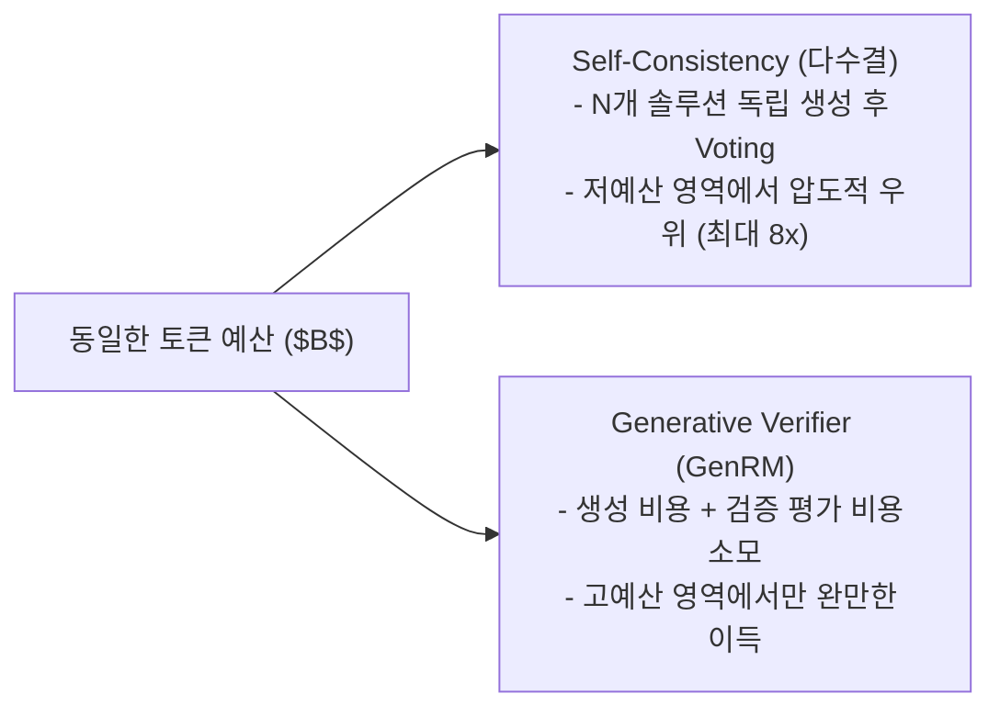
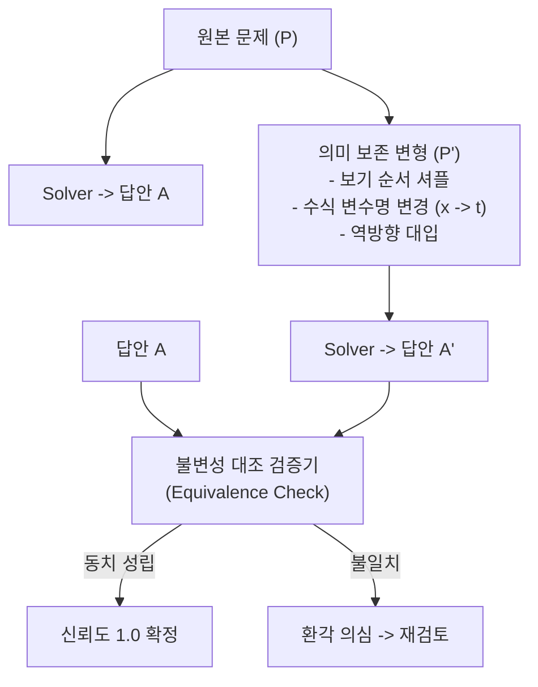

# 04. Verification, Jury & Metamorphic Testing (검증, 배심원 및 변형 테스트 연구)

> **핵심 테제:** LLM으로 다른 LLM을 검증(Generative Verifier)하는 것은 비용 대비 비효율적이며 검증자 착각을 유발한다. 고정 예산에서는 다수결이 우수하며, 최종 관문은 LLM 호출 0회의 결정론적 프로그램(Deterministic Preflight)과 변형 불변성(Metamorphic) 검사가 맡아야 한다.

---

## 1. 생성형 검증자(GenRM)의 계산 효율성 한계 실측

### 1.1 "When To Solve, When To Verify" (arXiv:2504.01005)
2025년 발표된 본 연구는 고정된 추론 계산 예산(Fixed Inference Compute Budget) 하에서 **생성적 검증자(Generative Verifier / GenRM)**와 **자가 일관성 다수결(Self-Consistency / Majority Voting)**의 효율을 정밀 비교했다.

- **실측 결과:** 저~중간 예산 구간에서 Self-Consistency(다수결)는 GenRM과 동등한 정답률을 달성하는 데 **최대 8배 적은 연산량**만을 소모했다.
- **검증자 오류 상관관계:** 문제를 푼 모델과 동일하거나 유사한 계열의 모델을 검증자로 쓸 경우, 생성자가 빠진 논리적 함정에 검증자도 똑같이 동조(Sycophancy & Shared Blindspot)하는 현상이 발생한다.

---

## 2. 결정론적 프로그램 검증기 (Deterministic Preflight Engine)

LLM을 검증자로 호출하여 토큰을 낭비하는 대신, **순수 Python 정규식 및 AST/스트링 파서**로 구성된 `Preflight Validator`를 구축한다 (LLM 호출 0회).

### 2.1 트랙별 Preflight 검증 규칙 매트릭스

| 대상 트랙 | Preflight 검사 항목 | 검사 방식 (LLM 호출 0회) | 위반 시 피드백 신호 |
|---|---|---|---|
| **Coding** | 1. `*** PATCH START ***` / `END` 마커 존재 여부 2. 상대 파일 경로 유효성 3. `<<<<<<< SEARCH` 원문 일치 검사 4. 빈 SEARCH (새 파일 생성) 적합성 | 정규식 매칭 + 컨텍스트 원문 텍스트 내 substring 검색 | `SEARCH_NOT_VERBATIM: Line 3 of block 1 does not exist in context` |
| **Math** | 1. `FINAL ANSWER: \boxed{...}` 포맷 준수 2. `answer_format: integer` 시 실수/수식 여부 판정 3. LaTeX 괄호 짝 매칭 | 정규식 + SymPy/정수 파싱 | `MATH_FORMAT_ERROR: Expected integer but got expression` |
| **Generic** | 1. `ANSWER: <letter>` 한 글자 추출 여부 2. 해당 문항 `option_letters` (A~J) 범위 포함 여부 | 정규식 + Set Containment (`letter in options`) | `INVALID_OPTION: Option 'E' not in valid choices ['A', 'B', 'C', 'D']` |

### 2.2 Preflight 실패 시의 피드백 루프 (Concrete Feedback)
- 단순 "틀렸으니 다시 해봐"는 모델의 정답률을 올리지 못한다.
- Preflight는 실패 지점의 정확한 원문 라인과 기대 형식을 에디터에게 주입하여 1회에 한해 외과의사식 재시도를 수행한다.

---

## 3. Blind Jury & Metamorphic Testing

### 3.1 Blind Jury (독립 배심원 투표)
- 여러 에이전트가 토론을 거치면 첫 발언자의 오류에 전체가 끌려가는 집단 착각(Groupthink)이 일어난다.
- **Blind Ballot:** 두 개의 경량 솔버가 서로의 추론 과정을 보지 않고 독립적으로 답안을 도출.
  - 두 답안이 일치하면: **즉시 확정 (Early Exit)**
  - 두 답안이 불일치할 때만: **Auditor에게 두 답안과 차이점만을 전달하여 1회 판정 (Escalation)**

### 3.2 Metamorphic Guard (정답 라벨 없는 불변성 검증)
정답을 모르는 상황에서도 논리적 불변 관계(Metamorphic Relations)를 검사하여 환각을 걸러낸다:

