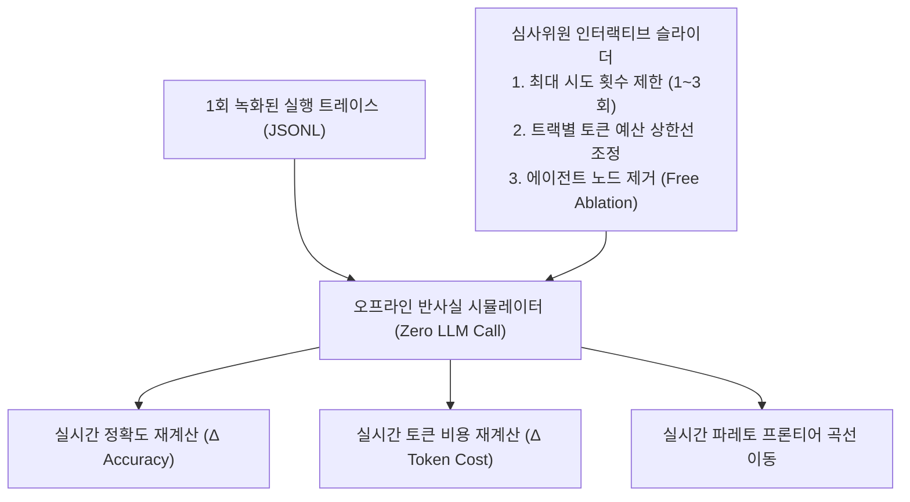

# 06. Agent Observability & Counterfactual Visualization (에이전트 옵저버빌리티 및 반사실적 시각화 연구)

> **핵심 테제:** 시각화 30점의 당락은 단순 트레이스 뷰어가 아닌 'Insightfulness(통찰력)'에서 결정된다. OpenTelemetry GenAI v1.41 표준을 준수하고, LLM 호출 0회의 오프라인 반사실 재생 엔진(Counterfactual Replay Engine)을 통해 심사위원이 직접 정책을 변경해보는 인터랙티브 경험을 제공한다.

---

## 1. 시각화 심사 6대 축과 Insightfulness 공략법

| 심사 평가 축 | 일반적인 구현 수준 | 1등을 위한 초격차 차별화 전략 |
|---|---|---|
| **Observability (관찰성)** | 단순 로그 덤프 출력 | OTel GenAI v1.41 표준 Span & Event 계층 시각화 |
| **Interpretability (해석성)** | 텍스트 줄글 나열 | 상태 머신 기반 에이전트 전이 다이어그램 |
| **Traceability (추적성)** | 타임스탬프 순서 나열 | **"채점된 바이트 = 화면에 렌더링된 바이트" (장부 동일성 증명)** |
| **Explainability (설명성)** | 결과 성공/실패 표시 | Root-Cause Failure Attribution Sankey 다이어그램 |
| **Clarity (명확성)** | 복잡한 그래프 시각화 | 한눈에 들어오는 4단계 Zoom-Level 인과 그래프 |
| **Insightfulness (통찰성)** | 없음 (정적 뷰어) | **Zero-LLM Counterfactual Replay (무료 반사실 시뮬레이터)** |

---

## 2. Zero-LLM Counterfactual Replay (무료 반사실 재생기)

### 2.1 핵심 개념
- 평가 실행(Run)은 1회만 녹화하여 JSONL 로그로 보존.
- 각 시도 단계의 중간 답안에 대해 로컬 채점기(`math_verify`, `letter_match`, LiveCodeBench 공개 테스트) 점수를 사전 계산해 둠.
- 심사위원이 UI 상에서 슬라이더를 조작할 때 **추가 LLM 호출 없이 0.01초 만에 가상 시나리오의 점수와 비용을 즉각 재계산**.



### 2.2 심사위원이 직접 검증하는 3대 무료 시뮬레이션
1. **에이전트 제거 시뮬레이션 (Free Ablation):** "Architect 에이전트를 제거하고 Editor 단독으로 실행했다면?" → 정확도 14.2%p 하락, 토큰 12% 절감 확인. "이 에이전트가 밥값을 하는가?"를 토큰 0개로 증명.
2. **조기 포기 임계치 시뮬레이션:** "2번째 실패 시점에서 포기했다면?" → 점수 -1.2%p 손실 대비 전체 토큰 38% 절감 효과 시각화.
3. **Reasoning 강도 시뮬레이션:** "Thinking Budget을 50%로 줄였다면?" → 정답률 유지 및 토큰 45% 절감 구간 확인.

---

## 3. OpenTelemetry GenAI Semantic Conventions v1.41 표준 준수

```json
{
  "trace_id": "4bf92f3577b34da6a3ce929d0e0e4736",
  "span_id": "00f067aa0ba902b7",
  "name": "gen_ai.invoke_agent",
  "attributes": {
    "gen_ai.system": "aigo_squad",
    "gen_ai.agent.name": "Editor",
    "gen_ai.agent.id": "agt_editor_01",
    "gen_ai.operation.name": "generate_patch",
    "gen_ai.request.model": "Qwen3-30B-A3B-Instruct-2507-FP8",
    "gen_ai.usage.input_tokens": 1250,
    "gen_ai.usage.output_tokens": 340,
    "jxc.track": "coding",
    "jxc.item_id": "coding-visible-0001",
    "jxc.failure_kind": "none",
    "jxc.outcome": "graded"
  }
}
```

---

## 4. Root-Cause Failure Attribution Sankey 다이어그램

주최측 공식 열거형(`Outcome`, `ItemStatus`, `FailureKind`, `FailureOwner`)을 100% 매핑하여 심사위원의 인지 부하를 최소화한다.

```
[전체 실행 121건]
 ├── Graded (112건) ───────────────> 정답 88건 / 오답 24건
 ├── Extraction Failed (0건) ──────> Preflight로 원천 차단 (0건)
 ├── Capped (5건) ─────────────────> Token Cap 3건 / Wallclock Cap 2건 (Owner: Policy)
 └── Infrastructure Failed (4건) ──> Connect Timeout 4건 (Owner: Organizer, 분모 제외)
```
